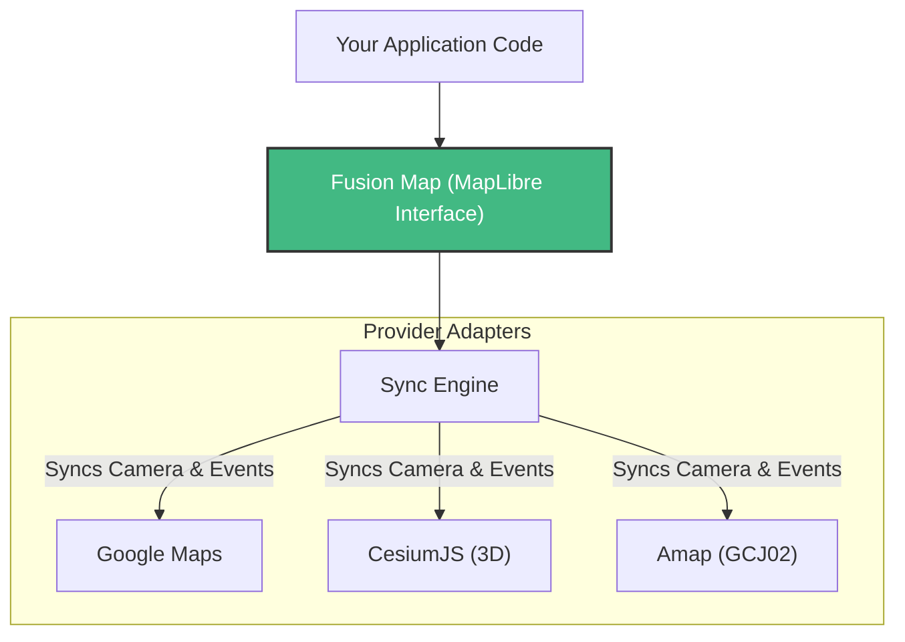

# Fusion Map (fusion-map)

[English](./README.md) | [简体中文](./README_zh-CN.md) | [Live Demo](https://easy-map.tanxin.link/index.html)

**Fusion Map** is a powerful unified mapping library that seamlessly bridges **MapLibre GL JS** with major global map providers, including **Google Maps**, **Cesium (3D Globe)**, **Amap (Gaode)**, **Baidu Map**, and **Tianditu**.

It allows you to overlay MapLibre's high-performance vector rendering and styling capabilities on top of third-party base maps, maintaining perfect synchronization of camera state (Zoom, Pitch, Bearing, Center).

## 💡 Core Philosophy: Write Once, Run Everywhere

**Fusion Map** employs a decoupled architecture where MapLibre acts as a **transparent interaction layer** over the native base map. 



This means you can write your visualization code **solely using the standard MapLibre GL JS API**.

## 🌟 Visual Capabilities

- **Infinite Layer Stacking**: Stack WebGL-powered Deck.gl, Three.js, or Mapbox layers.
- **Seamless 2D/3D Transition**: Smoothly switch from a flat street view to a global 3D terrain view.
- **High-Performance**: Leveraging GPU acceleration for both the top overlay and the bottom base map.

## 🌟 Key Features

- **Unified Interface**: Use standard MapLibre GL JS commands (`addLayer`, `addSource`, `flyTo`) while the underlying base map handles the rendering of satellite/roadmap tiles.
- **Multi-Provider Support**: 
  - **Google Maps**: Supports Vector (Roadmap) and Satellite modes.
  - **CesiumJS**: Full 3D Globe integration with vertical FOV matching.
  - **Amap (Gaode)**: GCJ02 offset correction included.
  - **Baidu Map (BMapGL)**: BD09 transformation and tilt support.
  - **Tianditu**: Native WMTS support.
- **Automatic Projection Switching**: Automatically toggles between `Globe` (3D) and `Mercator` (2D) projections based on the active provider.
- **Smart Synchronization**:
  - Auto-calibrates Zoom levels (e.g., matching MapLibre's 512px tiles to Google's 256px grid).
  - Synchronizes Pitch and Bearing (Rotation) where supported.
  - Prevents Gimbal Lock in Cesium.
- **Coordinate Transformation**: Built-in support for WGS84, GCJ02, and BD09 conversions using `gcoord`.

## 📦 Installation

```bash
npm install easy-map maplibre-gl
# Optional: Install Cesium if you need 3D Globe support
npm install cesium
```

## 🚀 Usage

### 1. Basic Initialization

```typescript
import { FusionMap } from 'easy-map';
import 'maplibre-gl/dist/maplibre-gl.css';

const map = new FusionMap({
  container: 'map-container', // HTML Element ID
  mapOptions: {
    style: 'https://demotiles.maplibre.org/style.json', // Your MapLibre Style
    center: [116.397, 39.918],
    zoom: 12
  },
  // Provide API Keys for the providers you want to use
  tokens: {
    amap: 'YOUR_AMAP_JS_API_KEY',
    baidu: 'YOUR_BAIDU_AK',
    google: 'YOUR_GOOGLE_MAPS_API_KEY',
    googleMapId: 'YOUR_GOOGLE_MAP_ID', // Required for Vector/3D mode
    cesium: 'YOUR_CESIUM_TOKEN',
    tianditu: 'YOUR_TIANDITU_TOKEN'
  }
});
```

### 2. Switching Base Maps

Switching providers is instant and maintains your current camera view.

```typescript
// Switch to Amap (Auto-converts WGS84 -> GCJ02)
map.switchBaseMap('amap');

// Switch to Cesium 3D Globe
map.switchBaseMap('cesium');

// Switch to Google Maps
map.switchBaseMap('google');
```

### 3. Adding Layers

You interact with the `map` instance just like a standard MapLibre instance.

```typescript
map.map.addLayer({
  'id': 'points',
  'type': 'circle',
  'source': {
    'type': 'geojson',
    'data': {
      'type': 'FeatureCollection',
      'features': [
        { 'type': 'Feature', 'geometry': { 'type': 'Point', 'coordinates': [116.397, 39.918] } }
      ]
    }
  },
  'paint': {
    'circle-radius': 10,
    'circle-color': '#007cbf'
  }
});
```

## ⚠️ Requirements

- **Cesium**: Peer dependency. Required only if using 'cesium' mode.
- **Google Maps**: Requires a valid API Key with **Maps JavaScript API** enabled. For tilt/heading support, vector maps (v=beta) are recommended.

## 🤝 Contributing

Pull requests are welcome! For major changes, please open an issue first to discuss what you would like to change.

## 📄 License

MIT
