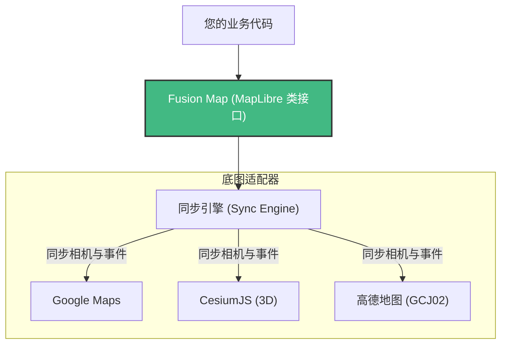

# Fusion Map (fusion-map)

[English](./README.md) | [简体中文](./README_zh-CN.md) | [在线演示](https://easy-map.tanxin.link/index.html)

**Fusion Map** 是一个强大的统一地图库，它无缝桥接了 **MapLibre GL JS** 与全球主流的地图服务商，包括 **Google Maps**、**Cesium (3D 地球)**、**高德地图 (Amap)**、**百度地图 (Baidu)** 和 **天地图 (Tianditu)**。

它允许您利用 MapLibre 高性能的矢量渲染和样式能力，叠加在第三方底图之上，同时保持相机状态（缩放、俯仰、旋转、中心点）的完美同步。

## 💡 核心理念：一次编写，多端运行

**Fusion Map** 采用了解耦架构，将 MapLibre 作为一个**透明的交互顶层**覆盖在原生底图之上。



这意味着您只需要使用**标准的 MapLibre GL JS API** 编写业务代码，即可在所有平台无缝运行。

## 🌟 视觉能力升级

- **无限图层叠加**: 轻松叠加 Deck.gl、Three.js 或 Mapbox 风格的 WebGL 图层。
- **无缝 2D/3D 切换**: 从平面街道图平滑过渡到基于 Cesium 的全球 3D 地形视图。
- **极致性能**: 顶层与底层均利用 GPU 加速，保证大数据量下的流畅渲染。

## 🌟 核心特性

- **统一接口**: 使用标准的 MapLibre GL JS 指令（`addLayer`, `addSource`, `flyTo`），底层自动处理卫星/街道底图的渲染。
- **多底图支持**: 
  - **Google Maps**: 支持矢量 (Roadmap) 和卫星 (Satellite) 模式。
  - **CesiumJS**: 完整的 3D 地球集成，支持垂直视场角 (FOV) 匹配。
  - **高德地图 (Amap)**: 内置 GCJ02 坐标偏移纠正。
  - **百度地图 (Baidu Map)**: 支持 BD09 坐标转换及倾斜视角。
  - **天地图 (Tianditu)**: 原生 WMTS 支持。
- **自动投影切换**: 根据当前激活的底图，自动在 `Globe` (3D 球面) 和 `Mercator` (2D 平面) 投影之间切换。
- **智能同步**:
  - 自动校准缩放层级 (例如：将 MapLibre 的 512px 切片与 Google 的 256px 网格对齐)。
  - 在支持的平台上同步俯仰角 (Pitch) 和旋转角 (Bearing)。
  - 防止 Cesium 中的万向节死锁 (Gimbal Lock)。
- **坐标转换**: 内置 `gcoord` 支持 WGS84, GCJ02, 和 BD09 之间的自动转换。

## 📦 安装

```bash
npm install easy-map maplibre-gl
# 可选: 如果需要 3D 地球支持，请安装 cesium
npm install cesium
```

## 🚀 使用指南

### 1. 基础初始化

```typescript
import { FusionMap } from 'easy-map';
import 'maplibre-gl/dist/maplibre-gl.css';

const map = new FusionMap({
  container: 'map-container', // HTML 元素 ID
  mapOptions: {
    style: 'https://demotiles.maplibre.org/style.json', // 您的 MapLibre 样式
    center: [116.397, 39.918],
    zoom: 12
  },
  // 提供您需要使用的服务商 API Key
  tokens: {
    amap: 'YOUR_AMAP_JS_API_KEY',   // 高德
    baidu: 'YOUR_BAIDU_AK',         // 百度
    google: 'YOUR_GOOGLE_MAPS_API_KEY', // 谷歌
    googleMapId: 'YOUR_GOOGLE_MAP_ID',  // 矢量/3D 模式必需
    cesium: 'YOUR_CESIUM_TOKEN',    // Cesium
    tianditu: 'YOUR_TIANDITU_TOKEN' // 天地图
  }
});
```

### 2. 切换底图

切换底图是即时的，并会保持当前的相机视角。

```typescript
// 切换到高德地图 (自动转换 WGS84 -> GCJ02)
map.switchBaseMap('amap');

// 切换到 Cesium 3D 地球
map.switchBaseMap('cesium');

// 切换到 Google Maps
map.switchBaseMap('google');
```

### 3. 添加图层

您可以像操作标准的 MapLibre 实例一样与 `map` 交互。

```typescript
map.map.addLayer({
  'id': 'points',
  'type': 'circle',
  'source': {
    'type': 'geojson',
    'data': {
      'type': 'FeatureCollection',
      'features': [
        { 'type': 'Feature', 'geometry': { 'type': 'Point', 'coordinates': [116.397, 39.918] } }
      ]
    }
  },
  'paint': {
    'circle-radius': 10,
    'circle-color': '#007cbf'
  }
});
```

## ⚠️ 依赖说明

- **Cesium**: Peer Dependency (对等依赖)。仅在使用 'cesium' 模式时需要安装。
- **Google Maps**: 需要有效的 API Key 并开启 **Maps JavaScript API**。若需要 3D 倾斜/旋转支持，必须提供 **Vector Map ID**。

## 🤝 贡献代码

欢迎提交 Pull Request！对于重大变更，请先提交 Issue 讨论您想要更改的内容。

## 📄 开源协议

MIT
